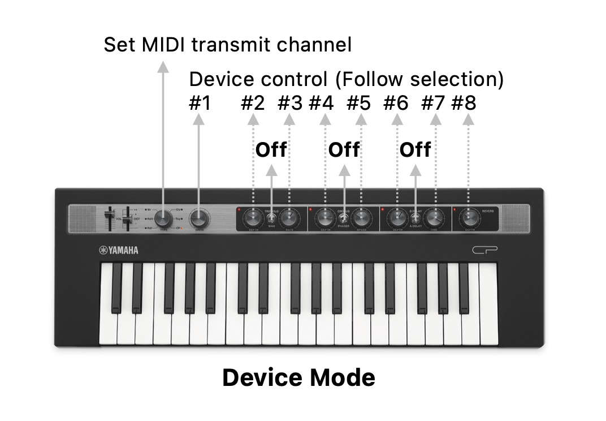
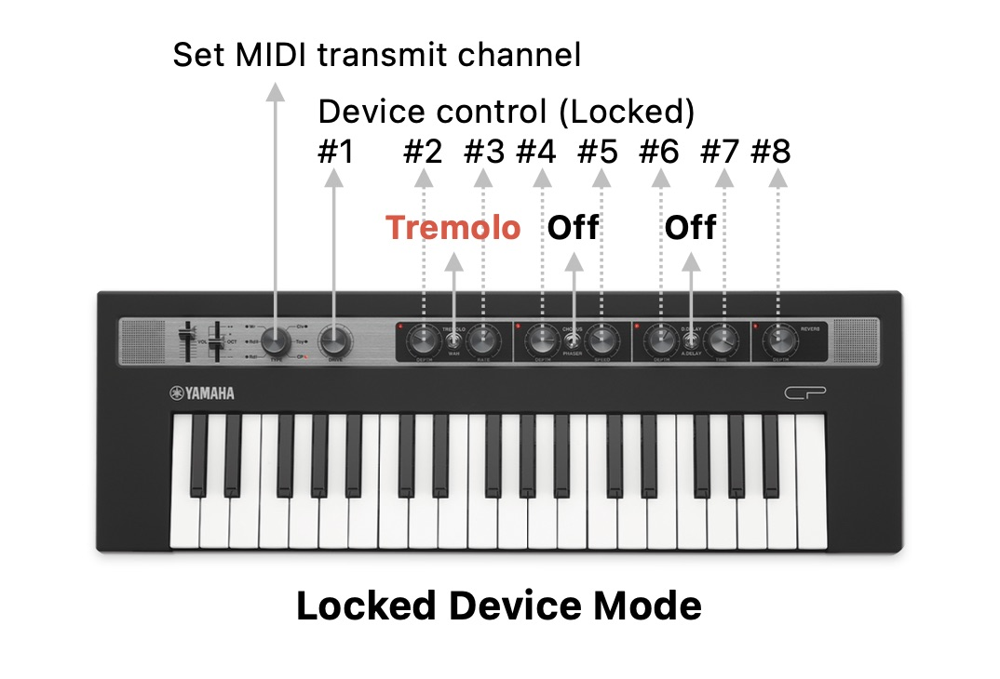
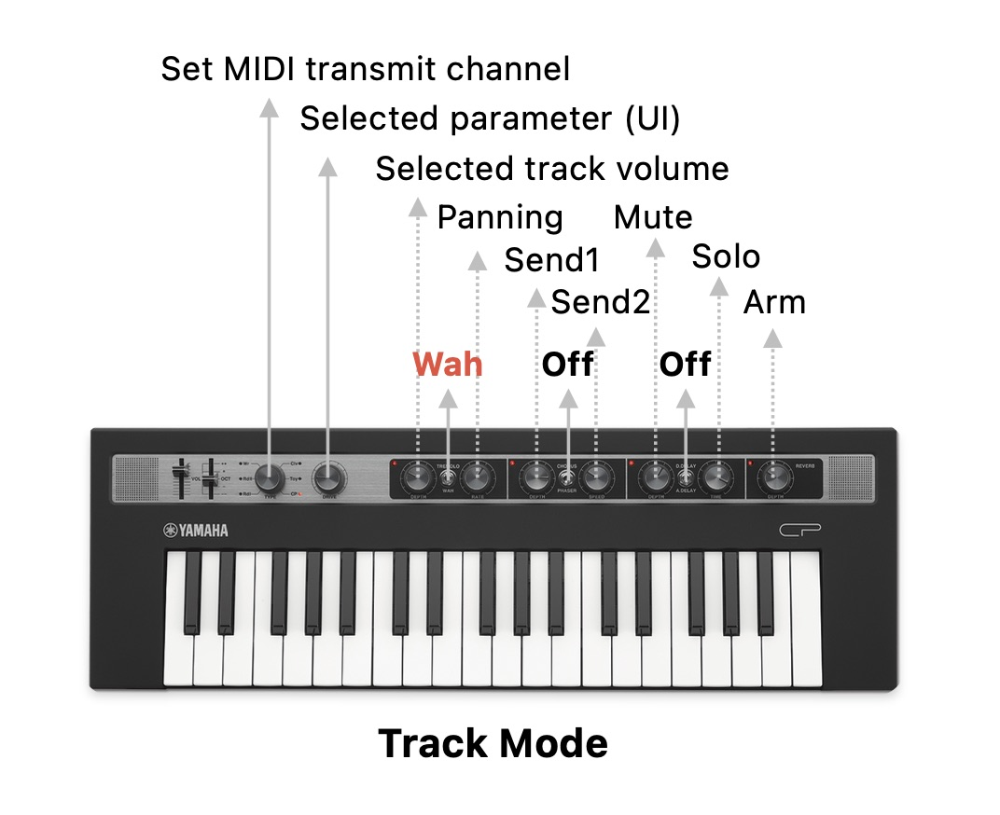
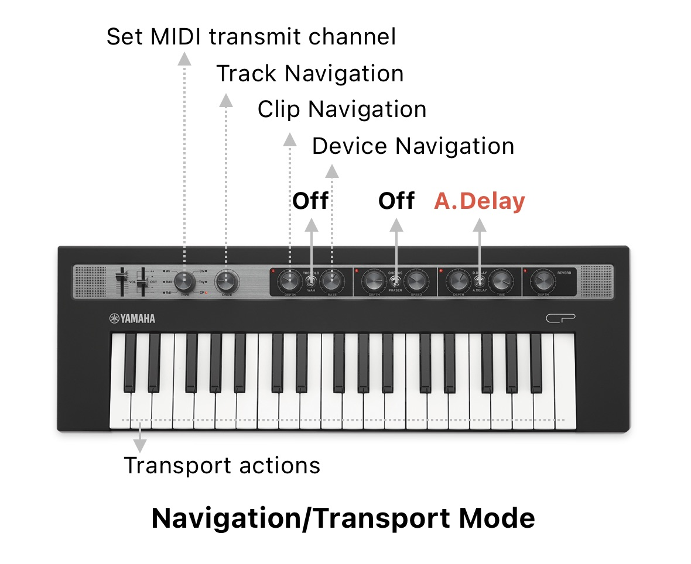
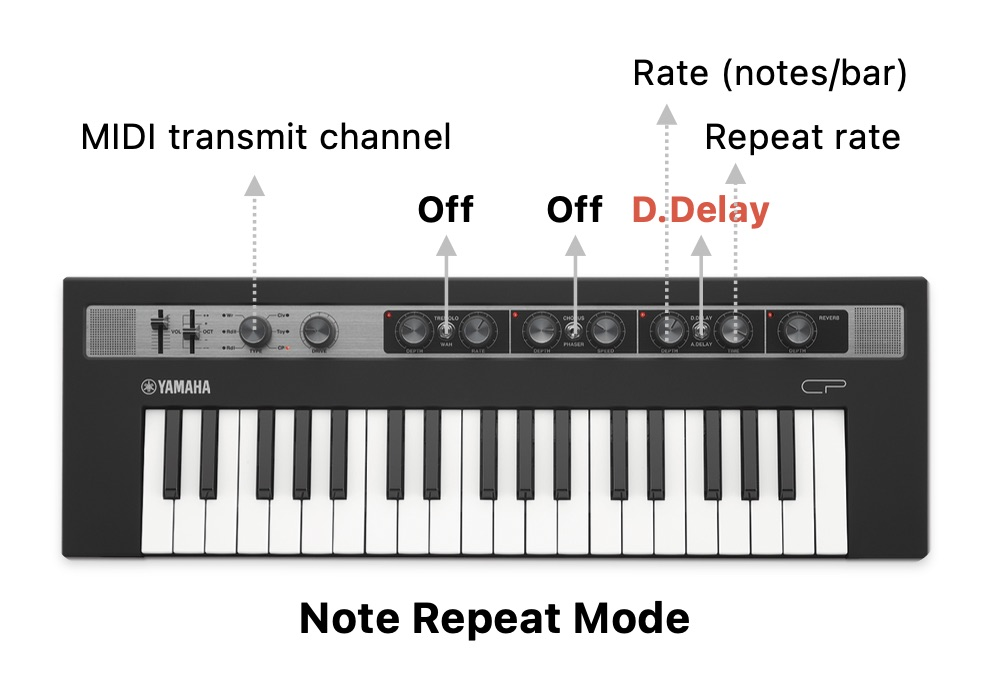

# RefaceCPLiveControl

RefaceCPLiveControl is an Ableton Live Control Surface script for the Yamaha Reface CP keyboard.

## Installation

1. Manually create a folder called `Remote Scripts` within your User Library if it does not already exist. The default User Library locations are:

   - **Windows:** `\Users\[username]\Documents\Ableton\User Library`
   - **Mac:** `Macintosh HD/Users/[username]/Music/Ableton/User Library`
   
2. Place the remote script folder called `RefaceCP` (the folder you found this README.md in) into the `Remote Scripts` from previous step.

This can also be done automatically with the `make install` command.

For more help, see [Installing third-party remote scripts](https://help.ableton.com/hc/en-us/articles/209072009-Installing-third-party-remote-scripts) from Ableton.

## Controls

### Wave type knob:

Changes the MIDI transmit channel from 1 (Rdl type) to 6 (CP type). MIDI tracks with an input routing from the `reface CP` source and the selected MIDI channel are automatically selected and armed. This is useful to quickly change and play instruments from tracks on specific MIDI channels. 

This also provides a lot more of flexibility to the custom MIDI mappings since each control can be mapped to any Live parameter across all 6 MIDI channels, effectively bringing up to 48 knobs, 18 toggles and 510 note keys for MIDI mapping in a Live Set.

*Note*: When mapping a control or key from the Reface using the custom user mapping Live overrides any special behaviour added by the script but in this case its functionality can still be reached by changing to any of the remaining unmapped MIDI channels for that control. Just prevent MIDI mapping the `type` knob so the channel can be changed.

### Tremolo/Wah switch:

* **Off**: When the switch is in the middle position (off), the 8 right-most knobs follow and control the selected device.

	

* **Tremolo On**: When the switch is enabled, the 8 right-most knobs are locked to control a specific device.

	

* **Wah On**: Enables the **Track mode**. This allows changing the selected track's volume, panning, sends A and B as well as the Mute, Solo and Arm buttons. In this mode the `Drive` knob is connected to the currently selected parameter in Live which can be very handy for quick automations.

	

### A.Delay switch:

Enables the **Navigation/Transport mode**. In this mode the knobs are used for navigation and the note keys for transport actions and more.

* **Drive**: Track navigation. Move the knob to change the track selection including sends and the master track. Since the knobs in the Reface CP are not endless the navigation will only work well for up to 127 tracks. If you have more than 127 tracks in your Live Set then some of the tracks won't be accessible using this knob but usually this doesn't happen unless you're Jacob Collier. In any case, the track can still be selected manually or using some of the actions from the list below.

* **Tremolo Depth**: Clip navigation. Move the knob to change the clip selection in the current track. Again, since the knobs in the Reface CP are not endless the clip selection works fine for up to 127 scenes. Still, some simple navigation can be performed using some of the actions from the list below.

* **Tremolo Rate**: Device navigation. Move the knob to change the device selection in the current track. This also has the 127 device limit.

	

In this mode each note key has a special function and can be recalled from any octave in the keyboard for easiness of use. In most cases, a secondary note can also be pressed to perform subactions. 

When pressing down the first key, a hint message is displayed in Live's bottom status bar. If the first note key is pressed and held for more than 3 seconds without pressing any other key the ongoing action is automatically cancelled to prevent triggering unwanted actions. This timeout corresponds to the duration that Live displays messages from the script in the status bar. 

Here are all the actions that can be triggered from the MIDI keyboard:

*Note*: Unless specified, all secondary action notes from the list correspond to the note within the same octave as the main action note. Higher or lower octaves are represented with a +n or -n text next to it.

#### C ⏐ *Stop actions*

* Press and release the key to stop playing.
* Press and hold + E to stop all clips from all tracks. 
* Press and hold + F to stop the current track clip (if any).

#### C# ⏐ *Recording actions*

* Press and release the key to toggle the Arrangement record.
* Press and hold + C to go back to Arrangement.
* Press and hold + D# to toggle the Session record.
* Press and hold + D to toggle MIDI Arrangement overdub.
* Press and hold + E to toggle automation arm.
* Press and hold + F to re-enable automation for any parameters that are currently overriden in the Arrangement or Session clips.

#### D ⏐ *Play actions*

* Press and release the key to start playing.
* Press and hold + use the white keys to change the song position (jump) according to the distance between the first key (D) and the second. This means the position can jump forwards by pressing a second higher white note or backwards by pressing a second lower white note.
* Press and hold + C# to jump to the previous cue marker.
* Press and hold + D# to jump to the next cue marker.
* Press and hold + F# to continue playback from the current position.

#### E ⏐ *Tempo actions*

* Press and release the key to toggle the Metronome.
* Press and hold + F to decrease the clip trigger quantization.
* Press and hold + F# to reset the clip trigger quantization to 1 bar.
* Press and hold + G to increase the clip trigger quantization.
* Press and hold + A to Tap Tempo.

#### F ⏐ *Track actions*

* Press and release the key to toggle the Clip/Device view.
* Press and hold + C to mute the selected track.
* Press and hold + C# to arm the selected track.
* Press and hold + D to solo the selected track.
* Press and hold + E to select to the previous track.
* Press and hold + G to select to the next track.
* Press and hold + A to select the current track's instrument.

#### G ⏐ *Clip actions*

* Press and release the key to show the Clip view.
* Press and hold + C to stop the selected clip.
* Press and hold + C# to delete the selected clip.
* Press and hold + D to fire the selected clip.
* Press and hold + E to fire the selected scene.
* Press and hold + F to select the previous clip slot.
* Press and hold + A to select the next clip slot.

#### A ⏐ *Device actions*

* Press and release to select the currently assigned (or locked) device.
* Press and hold + C to toggle the device on/off.
* Press and hold + G to select the previous device.
* Press and hold + B to select the next device.

#### A# ⏐ *Edit actions*

* Press and hold + A to undo last action.
* Press and hold + B to redo last action.

#### B ⏐ *Loop actions*

* Press and release the key to toggle loop.
* Press and hold + D# to jump song position to the loop start position.
* Press and hold + F# to decrease the loop length.
* Press and hold + G# to increase the loop length.
* Press and hold + A# to set the loop between the nearest cue points.
* Press and hold + use the white keys to change the loop start position according to the distance between the first key (G) and the second. This means the position can jump forwards by pressing a second higher white note or backwards by pressing a second lower white note.

### D.Delay switch:

Enables the **Note repeat mode**. In this mode, the MIDI notes from the keyboard are repeated automatically while they're pressed. Once enabled, the knobs control some settings for the note repeat:

* **Delay Time**: Sets the note repeat rate using fixed values from 1/32T to 1 bar.

* **Delay Depth**: Sets the note repeat rate by specifying the number of notes per bar.

	

## Constraints

Sadly, the Reface CP does not send any MIDI CC for the Volume and Octave faders. It's also a pity that the Type knob is not an endless encoder. This limits the possibilities of what could be achieved when used as a controller but I hope this still brings a new dimension to your great Reface CP. 

## Troubleshooting

In case your Reface CP does not produce any sound after using the script you can restore it to factory defaults by holding down the right-most C-key on the keyboard while pressing the Power (Standby/On) switch. This could happen in case of application crash or if the device is disconnected before closing Live. To avoid this, make sure Live application is closed before turning off the Reface. The script will restore the settings (like the speaker output) automatically when closing.

## Support

If you'd like to receive support, please send your feedback in the form of suggestions or bug reporting using the github issues.

If you’d like to send support for this project or other hundreds of ideas you can bring the drinks using the button below.
I will happily implement something similar for other synths if I receive enough feedback or someone gifts me a unit.

## Links

This is a collection of resources that I found useful while researching on this project. I'm collecting them here both as a documentation source and acknowledgement.

* [LOM - The Live Object Model](https://docs.cycling74.com/max8/vignettes/live_object_model): Official Live Object Model Documentation
* [Live API version 11.0.0](https://structure-void.com/PythonLiveAPI_documentation/Live11.0.xml): Unofficial Live API documentation generated by the "API_MakeDoc" MIDI Remote Script. https://structure-void.com
* [Live API version 12.1.0](https://ableton-live-docs.vercel.app/Live%2012.1.0.xml): Unofficial Live API documentation updated to version 12.1.0.
* [ableton-control-surface-toolkit](https://github.com/oslo1989/ableton-control-surface-toolkit): Repository for decompiled Ableton Python APIs and Control Surface definitions
* [AbletonLive12_MIDIRemoteScripts](https://github.com/gluon/AbletonLive12_MIDIRemoteScripts): Unofficial repository for Ableton Live 12.0.1 MIDI Remote Scripts Python Sources by Julien Bayle / Structure Void
* [_Framework](https://remotescripts.blogspot.com/2010/03/introduction-to-framework-classes.html): An Introduction to the Ableton Framework Classes by Hanz Petrov
* [Ableton Script Documentation](https://github.com/xot/ElectraOne/blob/main/DOCUMENTATION.md): Technical Documentation of the Ableton Live Remote Script for the Electra One (Jaap-Henk Hoepman)
